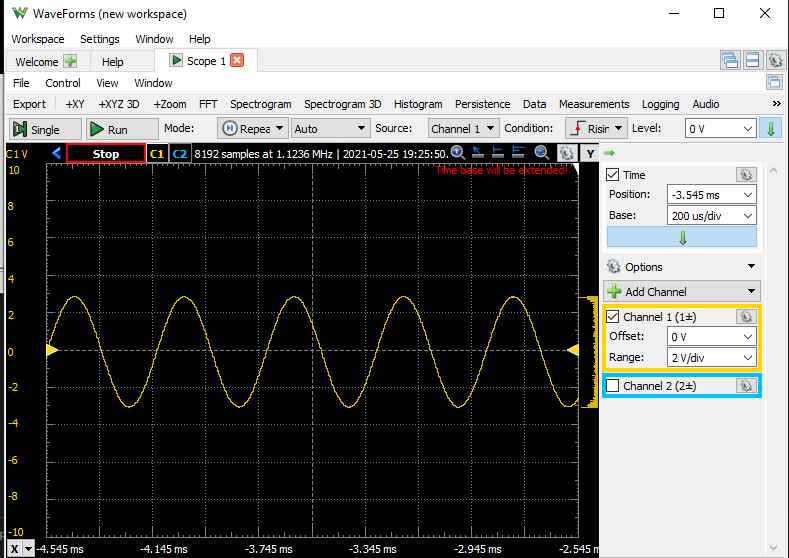

# Simple Raspberry Pico I2S Output Example

This is based on the Sine Wave example provided by the official Raspberry Pi Pico Playground: https://github.com/raspberrypi/pico-playground/tree/master/audio/sine_wave.

Requirements:
- Raspberry Pico SDK
- Pico-Extras (https://github.com/raspberrypi/pico-extras)

In this one, the example from the playground source has been simplified by having the SPDIF and the PWM defines and related code removed, leaving only the I2S example that can be directly tested, or can be used as a foundation for other Pico I2S projects.

Also, the project is programmed using the PicoProbe and the OpenOCD is at a separate folder because I have two different versions of this program (one for the FT2232, another is the PicoProbe). If you are using a default location for the OpenOCD, you can comment out or remove the "cortex-debug.openocdPath" setting at the "settings.json".

